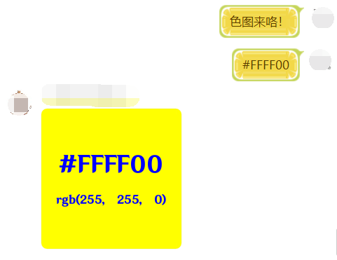

<h1 align="center">Nonebot Plugin Color</h1></br>


<p align="center">🤖 用于生成指定色彩图片的 Nonebot2 插件</p></br>


<p align="center">
  <a href="https://github.com/monsterxcn/nonebot-plugin-color/actions">
    
  </a>
  <a href="https://raw.githubusercontent.com/monsterxcn/nonebot-plugin-color/master/LICENSE">
    
  </a>
  <a href="https://pypi.python.org/pypi/nonebot-plugin-color">
    
  </a>
  <br />
</p></br>


**安装方法**


```bash
# 从 PyPI 安装
python3 -m pip install nonebot-plugin-color
```


<details><summary><i>从 Git 安装</i></summary></br>


```bash
# 从 Git 安装
git clone https://github.com/monsterxcn/nonebot-plugin-color.git
cd nonebot_plugin_color
cp -r nonebot_plugin_color /path/to/nonebot/plugins/
```


</details>


重启 Bot 即可体验此插件。


**使用方法**


插件支持类似以下格式的命令，基于正则匹配：


 - `#ABCD88`
 - `123 234 33`
 - `色图 #123456`
 - `color#123456`


<details><summary><i>哎哟这个色啊！好色！</i></summary></br>





</details>


**特别鸣谢**


[@nonebot/nonebot2](https://github.com/nonebot/nonebot2/) | [@Mrs4s/go-cqhttp](https://github.com/Mrs4s/go-cqhttp)
